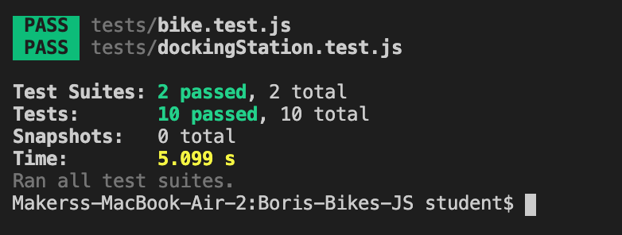

# Boris Bikes JS

**Requirements**

This is an attempt of the first weeks challenge at Makers Academy in Javascript

This project emulates London's Boris Bikes. It implements the following user stories:

# User Stories

```
As a member of the public,
So that I am not confused and charged unnecessarily,
I'd like docking stations not to release bikes when there are none available (Done ✓)

As a maintainer of the system,
So that I can control the distribution of bikes,
I'd like docking stations not to accept more bikes than their capacity. (Done ✓)

As a system maintainer,
So that I can plan the distribution of bikes,
I want a docking station to have a default capacity of 20 bikes. (Done ✓)

As a system maintainer,
So that busy areas can be served more effectively,
I want to be able to specify a larger capacity when necessary. (Done ✓)

As a member of the public,
So that I reduce the chance of getting a broken bike in future,
I'd like to report a bike as broken when I return it. (Done ✓)

As a maintainer of the system,
So that I can manage broken bikes and not disappoint users,
I'd like docking stations not to release broken bikes. (Done ✓)

As a maintainer of the system,
So that I can manage broken bikes and not disappoint users,
I'd like docking stations to accept returning bikes (broken or not). (Done ✓)
```

# To Run

```
git clone https://github.com/Thatguy560/Boris-Bikes-JS.git
cd Boris-Bikes-JS
npm install
open index.html
then open the console and create a docking station and bike using:


```

## Testing the repo:

```
git clone https://github.com/Thatguy560/Boris-Bikes-JS.git
cd Boris-Bikes-JS
npm test
```



I used Jest as a testing Framework
